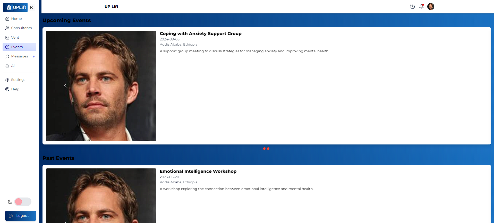

# UpLift

### Client Folder

#### Overview
The client-side of "Uplift" is built with Vite, leveraging modern JavaScript and React to provide a fast and responsive user experience.

#### Features
1. **Posts (Vents)**
   - Users can create and view posts to express their thoughts anonymously.

2. **AI Chat Bot**
   - Provides immediate assistance and support through AI-driven interactions.

3. **Events Page**
   - Displays upcoming events related to mental health and well-being.

4. **Messages Page**
   - Allows users to communicate in real-time via chat messages.

#### Installation
1. Clone the repository:
   ```bash
   git clone https://github.com/your/repository.git
   cd client
   ```

2. Install dependencies:
   ```bash
   npm install
   ```

#### Usage
1. Run the development server:
   ```bash
   npm run dev
   ```

2. Access the application at `http://localhost:3000`.

#### Screenshots
- : Description of the screenshot.
- : Description of the screenshot.
- : Description of the screenshot.
- : Description of the screenshot.
- : Description of the screenshot.
- : Description of the screenshot.
- : Description of the screenshot.
- : Description of the screenshot.
- : Description of the screenshot.
- : Description of the screenshot.

#### Deployment
- Modify the Vite configuration (`vite.config.js`) as needed for production builds.

#### Technologies Used
- **Vite**: Front-end build tool.
- **React**: JavaScript library for building user interfaces.
- **Socket.IO**: Real-time communication library for messaging.

### Server Folder

#### Overview
The server-side of "Uplift" is built with Express and Prisma, ensuring efficient data management and real-time messaging capabilities.

#### Features
1. **Real-time Messaging**
   - Uses Socket.IO for instant messaging between users.

2. **API Endpoints**
   - Provides endpoints for user authentication, posts, events, and messages.

3. **Database Integration**
   - Utilizes Prisma ORM for seamless database operations with PostgreSQL.

#### Installation
1. Navigate to the server directory:
   ```bash
   cd server
   ```

2. Install dependencies:
   ```bash
   npm install
   ```

3. Set up environment variables:
   - Create a `.env` file and configure database credentials and other environment variables.

#### Usage
1. Run the server:
   ```bash
   npm run start
   ```

2. The server will start at `http://localhost:5000`.

#### Deployment
- Configure deployment settings based on your hosting provider and environment variables.

#### Technologies Used
- **Express**: Web application framework for Node.js.
- **Prisma**: Database toolkit and ORM for Node.js and TypeScript.
- **Socket.IO**: Real-time communication library for WebSocket-based messaging.

### Additional Notes
- Ensure both client and server configurations are aligned for seamless communication and functionality.
- Update documentation as new features and improvements are implemented.

